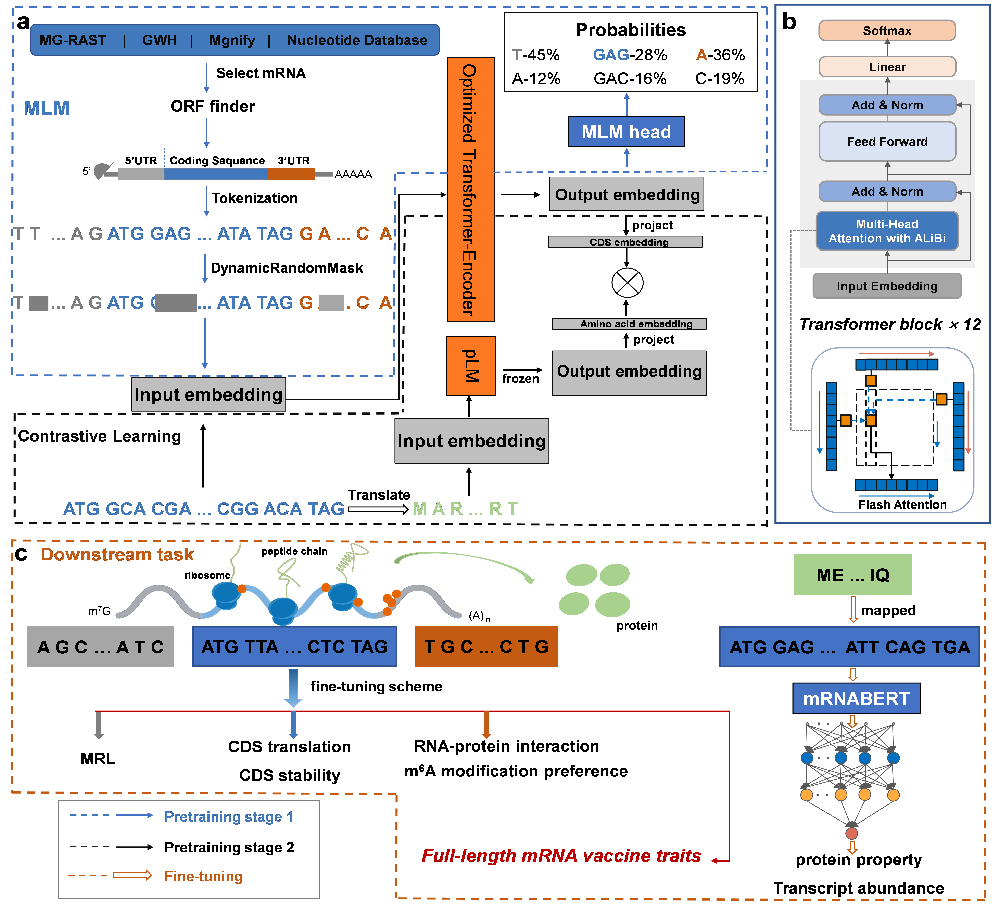

# mRNABERT

This repository includes the official implementation of [A Universal Model Integrating Multimodal Data for Comprehensive mRNA Property Prediction](https://arxiv.org/abs/2306.15006). We provide pre-trained model, examples of pre-training and fine-tuning, and pre-trained datasets.

## Contents

- [Introduction](#introduction)
- [Create Environment with Conda](#create-environment-with-conda)
- [Pre-trained Model and Datasets](#pre-trained-model-and-datasets)
- [Pre-Training](#pre-training)
- [Fine-tuning](#fine-tuning)
- [Citation](#citation)
- [Contact](#contact)

## Introduction

mRNABERT is a robust language model pre-trained on over 18 million high-quality mRNA sequences, incorporating contrastive learning to integrate the semantic features of amino acids.


## Create Environment with Conda

    # create and activate a virtual python environment
    conda create -n mrnabert python=3.8
    conda activate mrnabert
    
    # install required packages
    python3 -m pip install -r requirements.txt

## Pre-trained Model and Datasets

The pre-trained model is available at [Huggingface](https://huggingface.co/YYLY66/mRNABERT) as `YYLY66/mRNABERT`. 

The mRNA datasets are available on [Zendo](https://zenodo.org/records/12527829), featuring more than 36 million comprehensive mRNA or CDS sequences from various species.



**Notably, the data needs to be preprocessed.** We use [ORFfinder from NCBI](https://www.ncbi.nlm.nih.gov/orffinder) to predict the CDS regions of the mRNA. Then, please preprocess the data in different ways: use single-letter separation for the UTR regions and three-character separation for the CDS regions. We have provided custom functions: `Predict` is used for CDS prediction and outputs the annotated sequences, while `Splict` is used to split the sequence, for example:


### Access Pre-trained Models
You can download the pre-trained models from [Huggingface](https://huggingface.co/YYLY66/mRNABERT), or load the model from huggingface：

```python
import torch
from transformers import AutoTokenizer, AutoModel
from transformers.models.bert.configuration_bert import BertConfig

config = BertConfig.from_pretrained("YYLY66/mRNABERT")
tokenizer = AutoTokenizer.from_pretrained("YYLY66/mRNABERT")
model = AutoModel.from_pretrained("YYLY66/mRNABERT", trust_remote_code=True, config=config)
```

Extract the embeddings of mRNA sequences:

```python
seq = ["A T C G G A GGG CCC TTT", 
       "A T C G", 
       "TTT CCC GAC ATG"]  #Separate the sequences with spaces.

encoding = tokenizer.batch_encode_plus(seq, add_special_tokens=True, padding='longest', return_tensors="pt")

input_ids = encoding['input_ids']
attention_mask = encoding['attention_mask'] 

output = model(input_ids=input_ids, attention_mask=attention_mask)
last_hidden_state = output[0]

attention_mask = attention_mask.unsqueeze(-1).expand_as(last_hidden_state)  # Shape : [batch_size, seq_length, hidden_size]

# Sum embeddings along the batch dimension
sum_embeddings = torch.sum(last_hidden_state * attention_mask, dim=1)  

# Also sum the masks along the batch dimension
sum_masks = attention_mask.sum(1)  

# Compute mean embedding.
mean_embedding = sum_embeddings / sum_masks  #Shape:[batch_size, hidden_size]  

```

The extracted embeddings can be used for contrastive learning pretraining or as a feature extractor for protein-related downstream tasks.


## Pre-Training
### Data processing
Please see the template data at `/examples/sample_data/pre`, you should process your data into the same format as it. Please use `process_pretrain_data` for CDS prediction and  split.
### Pretraining stage 1
```
python  run_mlm.py \
  --output_dir= output/pretrain \
  --model_type=bert \
  --model_name_or_path = YYLY66/mRNABERT \
  --cache_dir= output/mRNABERT \
  --do_train  \
  --learning_rate 5e-5 \
  --num_train_epochs  10  \
  --gradient_accumulation_steps 4 \
  --train_file= /examples/sample_data/pre \
  --fp16 \
  --save_steps  2000 \
  --logging_steps 500 \
  --eval_steps 500 \
  --warmup_steps 1000 \
  --mlm_probability 0.15 \
  --line_by_line \
  --per_device_train_batch_size = 128
```
### Pretraining stage 2
We used the [OpenAI-CLIP](https://github.com/moein-shariatnia/OpenAI-CLIP) for contrastive learning.You can modify the code using the embedding extraction method mentioned above and reproduce the model training.


## Fine-tuning
### Data processing
Please see the template data at `/example/sample_data/ft/` and generate `3 csv files` from your dataset into the same format as it.Each file needs to have two columns with the header row labeled as `sequence` and `label`. Please use `process_finetune_data` for split. You can specify different split methods based on the types of data: `utr` for UTR sequences, `cds` for CDS sequences, and `complete` for complete mRNA sequences.

### Fine-tune with pre-trained model
Then, you are able to finetune mRNABERT with the following code:

```
#For regression tasks

export DATA_PATH= /example/sample_data/ft
python regression.py \
    --model_name_or_path  YYLY66/mRNABERT \
    --data_path   ${DATA_PATH}   \
    --run_name mRNABERT_${DATA_PATH} \
    --model_max_length 500 \  #set as the number of tokens.  
    --per_device_train_batch_size 16 \
    --per_device_eval_batch_size 8 \
    --gradient_accumulation_steps 1 \
    --learning_rate 5e-5 \
    --num_train_epochs 20 \
    --save_steps 100 \
    --output_dir output/finetune \
    --evaluation_strategy steps \
    --eval_steps 100 \
    --warmup_steps 100 \
    --logging_steps 100 \
    --overwrite_output_dir True \
    --log_level info \
    --find_unused_parameters False         
```
```
#For classification tasks

export DATA_PATH= /example/sample_data/ft
python classification.py \
    --model_name_or_path  YYLY66/mRNABERT \
    --data_path   ${DATA_PATH}   \
    --run_name mRNABERT_${DATA_PATH} \
    --model_max_length 500 \  #set as the number of tokens.  
    --per_device_train_batch_size 16 \
    --per_device_eval_batch_size 8 \
    --gradient_accumulation_steps 1 \
    --learning_rate 5e-5 \
    --num_train_epochs 20 \
    --save_steps 100 \
    --output_dir output/finetune \
    --evaluation_strategy steps \
    --eval_steps 100 \
    --warmup_steps 100 \
    --logging_steps 100 \
    --overwrite_output_dir True \
    --log_level info \
    --find_unused_parameters False         
```
Incidentally, you can also use this code to test other benchmark models through HuggingFace.


## Citation

If you find the models useful in your research, please cite our paper:

```

```
The model of this code builds on the [DNABERT-2](https://github.com/MAGICS-LAB/DNABERT_2?tab=readme-ov-file#2-model-and-data) modeling framework. We use [transformers](https://github.com/huggingface/transformers/tree/main/examples/pytorch/language-modeling) and [OpenAI-CLIP](https://github.com/moein-shariatnia/OpenAI-CLIP) framework to train our mRNA language models and [MultiMolecule](https://huggingface.co/multimolecule) for testing and comparing various benchmark models. We really appreciate these excellent works!

## Contact
If you have any question, please feel free to email us (22360244@zju.edu.cn).